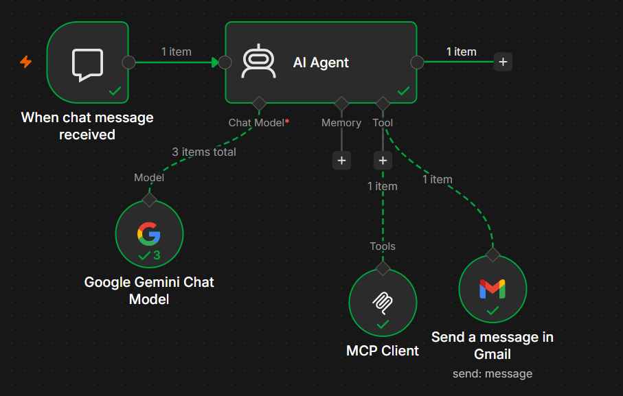
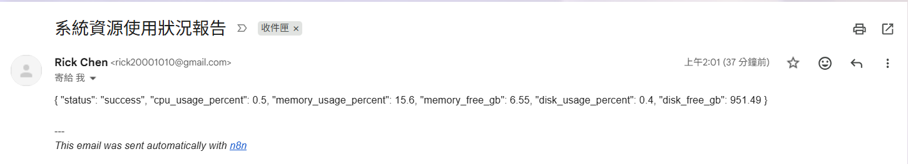

# Tiny Project for Connecting n8n with MCP

## System Architecture

* The system uses Docker to run both **n8n** and the **MCP server**.
* The MCP server uses **FastMCP** to create an MCP service for PC status monitoring.
* **n8n** uses the **Google Gemini AI Agent** to process user inputs and send emails. The AI Agent uses the **MCP client** to fetch PC status details from the MCP server.



## Workflow

1. When a user sends a chat message to n8n, the workflow is triggered.
2. The AI Agent processes the user input, queries the MCP server for system stats if needed, and sends an email to the user.

## How to Run

1. Copy `.env.example` to `.env` and configure your credentials:
   ```bash
   cp .env.example .env
   ```
2. Start the services using Docker Compose:
   ```bash
   docker compose up -d --build
   ```

---

## 📌 Important Notes

### Token & Cost Management
* Configure your LLM project parameters carefully (e.g., prompt size, system instructions) to avoid unnecessary token waste.
* Monitor your API usage; if token consumption exceeds your budget, you may need to adjust your usage limits or upgrade your API plan.

### GCP Gmail OAuth Setup
To connect n8n with Gmail, you need to set up OAuth credentials on Google Cloud Platform:
1. Go to the [Google Cloud Console](https://console.cloud.google.com/).
2. Search for **Gmail** and enable the **Gmail API**.
3. Navigate to **Credentials** and click **Create Credentials**.
4. Select **OAuth client ID**.
5. Set the Application Type to **Desktop app** (or **Web application** depending on your n8n redirect URI needs).
6. Click **Create** to generate your `client_id` and `client_secret`.
7. Add the Gmail account you wish to authorize as a **Test User** in the OAuth Consent Screen configuration.
8. Copy the credentials into n8n to complete the authentication.

---

## 🔮 Future Work

* Add a cron job to query the MCP server every 10 minutes and log the system metrics to Google Sheets.